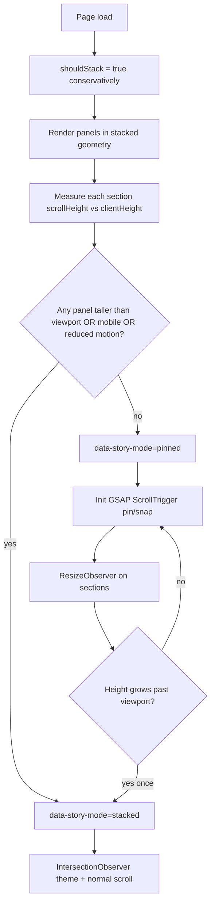

# fix: Prevent story-scroll panels from clipping content taller than the viewport

## Summary

Desktop pinned story panels are hard-capped to one viewport height, so bullets, proof logos, and the final CTA are clipped. Extend the existing stacked-mode fallback so desktop also stacks when any panel’s natural content height exceeds the viewport, reusing the same readable scroll path mobile and reduced-motion users already get.

---

## Problem Frame

Pinned desktop mode treats each story panel as exactly one viewport tall: panel wrappers use `absolute inset-0`, the story container uses `overflow-hidden`, and GSAP reinforces the same geometry. `StoryPanel` sections grow with their content (large clamp headings, bullets, logos), but the pinned wrapper does not — overflow is cut off with no way to scroll to it.

Investigation at 1512×856 confirmed all seven panels clip meaningful content when pinned (159–419px overflow per panel). Stacked mode (mobile, reduced motion) does not clip because panel wrappers are `relative` and sections expand naturally.

This violates the redesign invariant that **mode changes interaction, not message** (see `docs/solutions/design-patterns/story-scroll-founder-builder-homepage.md`) and conflicts with origin requirements R7/R8 and acceptance examples AE3/AE4 when applied to desktop pinned users.

---

## Requirements

### Content visibility
- R1. Every story panel must expose its full copy, bullets, tags, logos, and CTA to the visitor — no essential content may be permanently clipped by layout.
- R2. When pinned mode would clip content, the experience must fall back to stacked mode (normal document scroll) for the entire story, matching mobile/reduced-motion behavior.
- R3. When all panels fit within the viewport at the current size, pinned kinetic scroll, snap, and panel transitions must continue to work as today.

### Measurement and mode switching
- R4. Content-height measurement must use each panel’s natural stacked layout height, not the pinned viewport box (which underreports height).
- R5. Fallback is one-way for a page session: if content exceeded the viewport at mount or later via resize/fonts/images, stay stacked; do not oscillate back to pinned on resize.
- R6. Late-settling height (web fonts, proof logos) must not leave pinned mode with newly clipped content — re-measure and escalate to stacked if needed.

### Accessibility and header theming
- R7. When stacked (including overflow fallback), all panels remain in normal reading/focus order with no `inert` or `aria-hidden` on any panel.
- R8. `story-theme-change` must still update the fixed header legibly in stacked overflow-fallback mode (IntersectionObserver path).
- R9. Each panel exposes a single screen-reader landmark — remove duplicate `aria-label` on wrapper and inner `<section>`.

### Regression guardrails
- R10. Preserve existing pinned-mode invariants when pinned remains active: snap config, `normalizeScroll(true)`, `activeIndexRef` dedup, inactive-panel `inert`/`aria-hidden`.
- R11. Contact section remains reachable below the story without scroll traps or horizontal overflow (AE4).
- R12. `npm run lint`, `npm run test`, `npm run build`, and `npm run test:e2e` pass.

---

## Key Technical Decisions

- **Height-based global stacked fallback, not per-panel internal scroll.** One overflowing panel forces stacked mode for all seven panels. This reuses the proven stacked path, avoids nested scroll fighting ScrollTrigger, and matches the B2 recommendation in `docs/story-scroll-redesign-understanding-checklist.md`. Per-panel internal scroll and variable pin distances are deferred.

- **Measure before enabling GSAP pin.** Start with stacked layout (or a dedicated measurement pass in stacked geometry) before `useGSAP` initializes ScrollTrigger. Compare each panel section’s `scrollHeight` to `document.documentElement.clientHeight` with zero tolerance (`>`). Do not subtract fixed header height — panels already use full-viewport semantics (`min-h-screen`, `py-28`).

- **Conservative initial mode to avoid flash-of-pinned.** Default `shouldStack` to true until measurement completes on desktop, then promote to pinned only when all panels fit. Prevents a brief pinned render with clipped content and unnecessary GSAP init/teardown.

- **ResizeObserver for one-way escalation.** After initial decision, observe panel section roots; if any height grows past viewport while still pinned, flip to stacked once. Debounce resize events (~250ms). Never demote stacked → pinned mid-session (R5).

- **Overflow hygiene is complementary, not sufficient alone.** Change `StoryPanel` section from `overflow-hidden` to `overflow-x-hidden` (decorative “01” bleed only). When stacked, relax `.story-scroll` container overflow to visible; keep `overflow-hidden` on the container only while pinned.

- **Optional debug attribute.** Add `data-story-stack-reason` (`mobile` | `reduced-motion` | `overflow` | `single-panel`) on the story root for tests and debugging — does not replace `data-story-mode`.

---

## High-Level Technical Design



**Mode decision function (conceptual):**

```text
useStackedLayout =
  prefersReducedMotion
  || isMobile
  || panels.length <= 1
  || contentExceedsViewport   // new
  || !measurementComplete     // conservative gate
```

---

## Scope Boundaries

**In scope**
- Height measurement and stacked fallback in `src/components/ui/story-scroll.tsx`
- Section overflow hygiene and duplicate landmark fix in `src/components/sections/StoryPanel.tsx`
- Playwright coverage for overflow fallback at a desktop viewport where panels currently clip
- B2 checklist + solution doc update for expanded `shouldStack` semantics

**Out of scope**
- Per-panel internal scroll inside pinned viewport
- Variable ScrollTrigger pin distances per panel height
- Typography or copy reduction to force content into one viewport
- Refactoring GSAP snap/normalizeScroll/inert machinery beyond what mode switching requires

### Deferred to Follow-Up Work
- Per-panel kinetic scroll with variable pin distances (only if product requires pinned UX despite tall panels)
- Vitest unit tests for measurement helper (optional; Playwright is primary verification)
- `data-story-stack-reason` if deemed unnecessary after e2e lands

---

## Alternative Approaches Considered

| Approach | Why not v1 |
|----------|------------|
| Per-panel `overflow-y-auto` in pinned mode | Nested scroll fights page scroll and ScrollTrigger snap; awkward UX |
| Variable pin `end` per panel height | Major GSAP timeline rework; must re-validate S1 snap/theme math |
| Shrink typography / reduce panel content | Fragile across breakpoints; fights R7 readable settled panels |
| Remove only `StoryPanel` overflow | Parent pinned wrapper still clips; necessary hygiene only |

---

## Risks & Dependencies

| Risk | Mitigation |
|------|------------|
| False negative measurement in pinned geometry | Never measure inside `absolute inset-0`; stacked-first measure |
| Flash of pinned before fallback | Conservative `shouldStack=true` until measure completes |
| GSAP init on viewports that will fallback | Gate `useGSAP` on `!useStackedLayout && measurementComplete` |
| Post-load logo/font height growth | ResizeObserver one-way escalation to stacked |
| Loss of kinetic UX on typical desktops | Accepted trade-off; document in solution doc; all content visible |
| `normalizeScroll(true)` side effects when tearing down pin | Kill timeline + scrollTrigger on stacked flip; manual QA Contact scroll |
| Vitest setup mocks reduced-motion always | Override mock in any unit test added for measurement logic |

---

## Implementation Units

### U1. Content-height measurement and stacked fallback

- **Goal:** Decide `useStackedLayout` from natural panel heights and prevent GSAP from running when content would clip.
- **Requirements:** R1, R2, R3, R4, R5, R6, R10
- **Dependencies:** none
- **Files:**
  - `src/components/ui/story-scroll.tsx`
- **Approach:** Introduce `contentExceedsViewport` state and `measurementComplete` flag. On mount (and debounced resize), measure each panel’s inner `<section>` `scrollHeight` against `document.documentElement.clientHeight`. Extend `shouldStack` / `useStackedLayout` with `contentExceedsViewport`. Default stacked until measurement finishes. Attach `ResizeObserver` to section nodes; if height exceeds viewport while pinned, set `contentExceedsViewport` true (one-way). Ensure `useGSAP` early-returns when stacked or measuring. On flip to stacked, kill existing timeline/ScrollTrigger and reset `activeIndexRef`. Optionally set `data-story-stack-reason`.
- **Patterns to follow:** Lazy `useMediaQuery` initializer (`story-scroll.tsx`); existing `shouldStack` branches for stacked vs pinned classNames; B1 inert/aria-hidden only when pinned.
- **Test scenarios:**
  - Happy path (manual + e2e in U3): at viewport where all panels fit, `data-story-mode="pinned"`.
  - Overflow path: at 1512×856 (or equivalent), `data-story-mode="stacked"` with reason overflow.
  - Regression: mobile viewport still stacked; reduced-motion still stacked immediately.
  - Edge: single panel (`panels.length <= 1`) still stacked without measurement.
  - Edge: resize taller → shorter does not re-enable pin after overflow fallback (one-way).
  - Integration: flipping to stacked removes `inert`/`aria-hidden` from all panels.
- **Verification:** Playwright U3 passes; manual keyboard tab reaches all panel content on desktop overflow viewport.

### U2. Overflow hygiene and landmark cleanup

- **Goal:** Stop section-level vertical clipping in stacked mode and remove duplicate screen-reader landmarks.
- **Requirements:** R1, R9
- **Dependencies:** U1
- **Files:**
  - `src/components/sections/StoryPanel.tsx`
  - `src/components/ui/story-scroll.tsx` (container overflow when stacked)
- **Approach:** Replace section `overflow-hidden` with `overflow-x-hidden`. Keep decorative layer `overflow-hidden`. When `useStackedLayout`, apply `overflow-visible` (or equivalent) on `.story-scroll` container; retain `overflow-hidden` only in pinned mode. Remove `aria-label` from `<section>` — keep label on `.story-scroll-panel` wrapper only (or use `aria-labelledby` if needed).
- **Patterns to follow:** Existing theme/variant class composition via `cn()`.
- **Test scenarios:**
  - Happy path: stacked panel 3 proof logos fully visible in document flow (covered by U3 e2e).
  - a11y: one landmark per panel in accessibility tree (manual VoiceOver/axe spot check).
  - Test expectation: none for unit — layout/a11y covered by e2e and manual pass.
- **Verification:** No vertical clip from section overflow in stacked mode; axe/inspector shows single labelled region per panel.

### U3. Playwright regression tests for overflow fallback

- **Goal:** Lock in visibility of previously clipped content at a desktop viewport.
- **Requirements:** R1, R2, R11, R12
- **Dependencies:** U1, U2
- **Files:**
  - `e2e/homepage.spec.ts`
- **Approach:** Add desktop viewport test (1512×856 or 1280×720) with reduced motion **off**. Assert `[data-story-mode="stacked"]` **or** document that pinned mode is not used at that viewport after fix (expect stacked). Assert panel 7 CTA link “Start the conversation” is visible without being clipped. Assert panel 3 proof content (heading or a logo) reachable via scroll. Keep existing reduced-motion stacked test unchanged.
- **Patterns to follow:** Existing `e2e/homepage.spec.ts` structure; `#contact` scroll assertions from AE4.
- **Test scenarios:**
  - Covers AE4 (partial): desktop overflow viewport — all story content readable via scroll; contact reachable.
  - Regression: reduced-motion test still passes.
  - Happy path: opening heading still visible on load.
- **Verification:** `npm run test:e2e` green in CI.

### U4. Documentation and understanding checklist

- **Goal:** Record the fix and update institutional guidance so future agents do not re-break clipping invariants.
- **Requirements:** R12 (docs only)
- **Dependencies:** U1, U2, U3
- **Files:**
  - `docs/story-scroll-redesign-understanding-checklist.md`
  - `docs/solutions/design-patterns/story-scroll-founder-builder-homepage.md`
- **Approach:** Mark B2 items complete with why stacked fallback extends to desktop overflow. Update solution doc `shouldStack` snippet and accessibility section to mention height-based fallback. Note kinetic UX trade-off on viewports where panels exceed viewport height.
- **Test expectation:** none — documentation only.
- **Verification:** B2 section shows fixed status; solution doc reflects new fallback condition.

---

## Acceptance Examples

- **AE1. Covers R1 / R2.** Given a visitor on a 1512×856 desktop viewport with motion enabled, when they load the homepage, then `[data-story-mode="stacked"]` is present and the panel 7 “Start the conversation” control is reachable by scrolling without clipped overflow.

- **AE2. Covers R3.** Given a visitor on a viewport tall enough that all panel sections fit within `clientHeight`, when they load the homepage, then `[data-story-mode="pinned"]` is present and scroll snap advances between panels.

- **AE3. Covers R7 / R8.** Given overflow fallback stacked mode on desktop, when the visitor tabs through the story, then all seven panels are focusable and the header theme updates as panels scroll into view.

- **AE4. Covers R11.** Given any story mode after the fix, when the visitor scrolls to `#contact`, then the Netlify contact form is in viewport and submittable.

---

## Manual Acceptance Checklist

- [ ] Desktop 1512×856: no clipped bullets on panels 2, 4, 5, 6
- [ ] Desktop 1512×856: panel 3 tags + four client logos visible
- [ ] Desktop 1512×856: panel 7 body + CTA visible
- [ ] Tall desktop viewport (if available): pinned mode still works when content fits
- [ ] Mobile 390×844: unchanged stacked behavior
- [ ] Reduced motion: immediate stacked, no GSAP flash
- [ ] Keyboard: tab through all panels in stacked overflow mode
- [ ] Contact section scroll feels normal after story (trackpad + wheel)
- [ ] Header theme legible across accent/dark panels in both modes

---

## Sources & Research

- B2 investigation: `docs/story-scroll-redesign-understanding-checklist.md`
- Design pattern + stacked fallback principle: `docs/solutions/design-patterns/story-scroll-founder-builder-homepage.md`
- Origin requirements R7/R8, AE3/AE4: `docs/brainstorms/2026-06-03-story-scroll-redesign-requirements.md`
- GSAP preserve guidance: `docs/plans/2026-06-09-001-refactor-drop-framer-motion-plan.md` (R6)
- Clipping layers: `src/components/ui/story-scroll.tsx`, `src/components/sections/StoryPanel.tsx`
- Measured overflow: Playwright/CDP at 1512×856 — all panels clip when pinned
