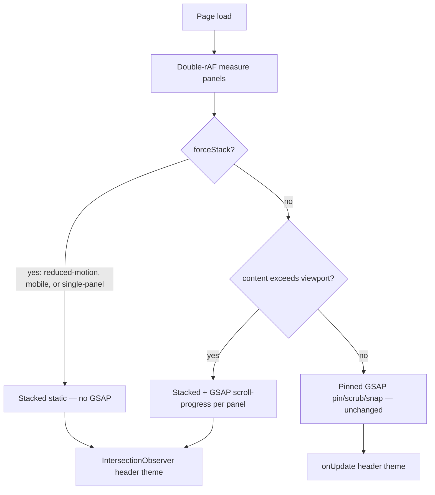

# feat: Restore stacked-mode kinetic scroll for homepage story panels

## Summary

Add GSAP scroll-progress panel boundary transitions in stacked story mode so typical laptop viewports (where overflow escalation disables pinned pin/scrub) regain perceptible kinetic scroll-through motion—without reintroducing Framer Motion, expanding GSAP beyond `story-scroll.tsx`, relaxing overflow invariants, or increasing the production bundle.

---

## Problem Frame

The June 2026 story-scroll redesign promised a bold, controlled-kinetic homepage narrative. Framer Motion was later removed from micro-interaction surfaces; GSAP remained scoped to `src/components/ui/story-scroll.tsx` for pinned pin/scrub panel transitions.

Commit `db79cfb` and plan `docs/plans/2026-06-09-002-fix-story-scroll-viewport-truncation-plan.md` correctly added a one-way overflow fallback: when any panel’s natural height exceeds the viewport, the story stacks with normal document scroll and **no GSAP timeline runs**. At 1512×856 (CI-verified), all seven panels overflow by 159–419px, so `data-story-mode="stacked"` with `data-story-stack-reason="overflow"` is expected—not a regression.

The user’s observation (“no animation effect when scrolling through the sections”) is therefore grounded: **most real desktop visitors never enter pinned mode**, and stacked mode currently provides only header theme updates via `IntersectionObserver`, not panel motion. Pinned GSAP (when panels fit at ~1300px+ viewport height—panel 3’s ~1275px natural height is the binding constraint) is unchanged but rare.

This plan closes the kinetic gap within the brainstorm’s hard constraints by making **stacked-mode scroll-linked panel transitions** the primary remediation path. (see origin: `docs/brainstorms/2026-06-11-revisit-framer-motion-kinetic-scroll-animations-requirements.md`)

---

## Requirements

### Architecture and performance (non-negotiable)

- R1. Production gzipped JS+CSS must not exceed the post–Framer-removal baseline measured in the same way as `docs/plans/2026-06-09-001-refactor-drop-framer-motion-plan.md` (origin R1; baseline methodology per drop-framer-motion plan R8; origin AE3 is the post-ship verification outcome, not the measurement procedure).
- R2. GSAP remains the single runtime animation engine and stays scoped to `src/components/ui/story-scroll.tsx`. No Framer Motion or other general-purpose runtime animation library is reintroduced.
- R3. `forceStack` rules (reduced-motion, mobile ≤767px), one-way `contentExceedsViewport` escalation, `inert`/`aria-hidden` on inactive pinned panels, and the global `prefers-reduced-motion` CSS rule remain unchanged. No relaxation of overflow measurement to allow clipped content.

### Kinetic behavior (product intent)

- R4. On stacked/overflow desktop viewports (the primary visitor band), scrolling through the seven story panels produces **perceptible panel boundary motion**—energetic enter/exit transitions that settle into readable states (redesign R6/R7 intent; origin R4/R5).
- R5. Pinned-mode GSAP pin/scrub/snap behavior when all panels fit must remain functionally equivalent to today (origin R3, truncation plan R10).
- R6. Contact and Section CSS entrance/stagger/hover behaviors remain as implemented; this plan does not reintroduce runtime libraries for those surfaces (origin R6).

### Verification and documentation

- R7. E2E coverage asserts stacked kinetic mode at 1512×856 and pinned mode on a viewport tall enough for all panels to fit; existing overflow-fallback and reduced-motion tests continue to pass.
- R8. Binding docs (`docs/solutions/design-patterns/story-scroll-founder-builder-homepage.md`, `docs/solutions/tooling-decisions/drop-framer-motion-for-css-and-gsap.md`, `docs/story-scroll-redesign-understanding-checklist.md`) reflect the stacked-kinetic contract so future agents do not re-fight this tension (origin R7, AE2).

---

## Key Technical Decisions

- **Stacked-first remediation, not pinned re-enablement on typical laptops.** Overflow escalation is correct and load-bearing; the kinetic gap is stacked mode’s lack of motion. Content compaction to fit panels in one viewport is out of scope for this plan—it would fight panel 3’s ~1275px natural height and readability requirements. (User-confirmed; see origin Key Decisions on fbf0bc8 measurement)

- **GSAP scroll-progress without pin for stacked mode.** When `useStackedLayout` is true and `!forceStack` (i.e., desktop overflow stacked, not mobile/reduced-motion), mount a separate GSAP `ScrollTrigger` timeline per panel (or equivalent scroll-linked setup) that animates panel boundary enter/exit—`yPercent`/opacity/scale vocabulary aligned with pinned transitions but **without** `pin: true`, `normalizeScroll`, or snap. This reuses the already-loaded GSAP chunk (R1) and keeps all runtime logic in `story-scroll.tsx` (R2). CSS-only IO entrances were rejected for this plan because they produce one-shot fades, not scroll-through kinetic feel. (User-confirmed)

- **Panel boundary transitions only; no in-panel child orchestration in v1.** Headlines, bullets, and logos animate as part of the panel wrapper transition, not via separate scroll-scrubbed child timelines. Child reveals are deferred to follow-up work if the feel remains flat after panel boundaries ship. **Fail trigger:** if the U2 manual kinetic review at 1512×856 reads as generic fade rather than controlled-kinetic scroll-through, pull minimal child reveals for panels 1 and 3 into scope before ship. (User-confirmed)

- **Reduced-motion and mobile remain GSAP-free.** Stacked kinetic GSAP runs only when `useStackedLayout && !forceStack`. Mobile and `prefers-reduced-motion` visitors keep the current static stacked experience plus CSS zeroing—preserving the two-layer reduced-motion strategy documented in `docs/solutions/tooling-decisions/drop-framer-motion-for-css-and-gsap.md`.

- **Extract measurement helpers for unit testing.** Move `panelContentExceedsViewport` and `anyPanelExceedsViewport` to a small colocated module (e.g., `src/components/ui/story-scroll-measurement.ts`) so mode-decision logic is testable without mounting GSAP. No change to measurement semantics.

- **E2E kinetic assertion via scroll position + computed style or data attribute.** Playwright cannot judge “feels kinetic”; tests should assert a `data-story-kinetic="stacked-scrub"` (or similar) debug attribute and that scroll progression changes a measurable style property (e.g., `opacity` or `transform` on the active panel) between scroll positions—avoiding flaky pixel-perfect screenshots.

---

## High-Level Technical Design

### Mode and animation paths



### Stacked kinetic scroll-progress (new path)

Directional guidance for implementers—not copy-paste specification:

```
WHEN useStackedLayout AND NOT forceStack AND measurementComplete:
  FOR each panel wrapper in document flow:
    ScrollTrigger:
      trigger: panel
      start: "top 85%"   // tune: panel enters kinetic zone
      end: "top 15%"     // tune: panel exits upward
      scrub: ~0.3–0.5    // align with pinned scrub feel
      animation: panel enters from yPercent +opacity, exits subtle scale/opacity
      onEnter/onLeaveBack: optional theme sync (IO remains primary for theme)
  DO NOT: pin, normalizeScroll, snap, inert inactive panels
```

Panels remain `position: relative` in normal document flow. Animations must **reverse on scroll-up** (scrub-linked, not `toggleActions` one-shots) to preserve kinetic scroll-through feel.

**Panel lifecycle (stacked kinetic):** each panel passes through off-screen below → entering (scrub in) → settled-readable (opacity 1, neutral transform in the mid-scroll band) → exiting (scrub out) → off-screen above. Only one panel should be in the settled-readable band at a time; adjacent triggers may overlap during handoff, but avoid two panels both at peak motion amplitude simultaneously.

**Stacked transform caps (v1, ~50% of pinned amplitudes):** max `yPercent` ±8 on enter/exit; `scale` clamped to 0.96–1; **omit `rotateX` in stacked mode** (pinned uses `[perspective:1200px]`; stacked container does not). Panel 3 (proof variant) uses the lower half of these caps so proof logos/tags never clip during scrub.

### Pinned path (unchanged)

Existing `useGSAP` branch when `!useStackedLayout` continues to own pin/scrub/snap, `inert`/`aria-hidden`, and `normalizeScroll(true)`. Stacked kinetic timeline must not initialize in pinned mode and must clean up on mode escalation (overflow resize → stacked).

---

## Scope Boundaries

### In scope

- Stacked-mode GSAP scroll-progress panel boundary transitions in `story-scroll.tsx`
- Measurement helper extraction and unit tests
- E2E coverage for stacked kinetic and pinned paths
- Documentation updates per R8

### Deferred for later (from origin)

- Named treatment for in-development products
- Portfolio/case-study pages with richer animation tooling
- Shared animation utilities beyond `useExitTransition`
- Bundle analysis tooling beyond existing manual measurement

### Deferred to Follow-Up Work

- In-panel child element reveals (headlines, bullets, logos staggered on scroll progress)
- Content/layout compaction to widen pinned-mode eligibility on sub-1300px viewports
- Visual regression GIF capture for kinetic feel review
- INP/scroll-jank metric gates

### Outside this product's identity (from origin)

- Re-adding Framer Motion or any general-purpose runtime animation library
- Increasing cold-load JS weight or rAF motion outside `story-scroll.tsx`
- Relaxing overflow rules to allow clipped pinned content
- Separate mobile/reduced-motion story content

---

## Implementation Units

### U1. Baseline capture and measurement testability

**Goal:** Establish reproducible before/after bundle numbers and make mode-decision logic unit-testable without changing runtime behavior.

**Requirements:** R1, R3

**Dependencies:** None

**Files:**
- `src/components/ui/story-scroll-measurement.ts` (create)
- `src/components/ui/story-scroll.tsx` (modify — import helpers)
- `src/components/ui/story-scroll-measurement.test.ts` (create)

**Approach:** Extract `panelContentExceedsViewport` and `anyPanelExceedsViewport` unchanged. Record current production gzipped JS+CSS total in the plan commit message or a brief note in `docs/story-scroll-redesign-understanding-checklist.md` (manual measurement row). No animation changes in this unit.

**Patterns to follow:** Existing vitest setup in `src/test/setup.ts`; colocated `*.test.ts` next to source.

**Test scenarios:**
- Happy path: mock panel with inner `section` shorter than `document.documentElement.clientHeight` → `panelContentExceedsViewport` returns false
- Edge case: section exactly equal to `clientHeight` → returns false (strict `>` threshold)
- Edge case: section one pixel taller → returns true
- Edge case: missing inner `section` → returns false
- Integration: `anyPanelExceedsViewport` returns true when any panel in array exceeds

**Verification:** `npm run test` passes; extracted helpers used by `story-scroll.tsx` with identical behavior; bundle baseline number recorded.

---

### U2. Stacked-mode GSAP scroll-progress panel transitions

**Goal:** When desktop overflow stacked (`useStackedLayout && !forceStack && measurementComplete`, steady-state `data-story-mode="stacked"` with `data-story-stack-reason="overflow"`), scrolling produces perceptible panel boundary kinetic motion.

**Requirements:** R2, R3, R4, R5

**Dependencies:** U1

**Files:**
- `src/components/ui/story-scroll.tsx` (modify)
- `src/components/sections/StoryScrollExperience.tsx` (verify — no changes expected)
- `src/components/sections/StoryPanel.tsx` (verify — panel structure unchanged)

**Approach:** Add a `useGSAP` branch (or second hook invocation) gated on `useStackedLayout && !forceStack && measurementComplete`. Include `forceStack` in the stacked hook’s `dependencies` array so scrub timelines revert when mobile/reduced-motion toggles. Create per-panel `ScrollTrigger` scrub timelines for enter/exit transforms on panel wrappers—use pinned vocabulary (`yPercent`, opacity, subtle `scale`) at the reduced stacked caps above (no `rotateX`). Set `data-story-kinetic="stacked-scrub"` on the story root when this path is active. On `contentExceedsViewport` escalation from pinned, kill pinned timeline and allow stacked scrub to initialize on next effect cycle. Do not enable `normalizeScroll` in stacked path. While `!measurementComplete`, keep panels static (no transform jump) until the gate opens.

**Execution note:** Manually verify on 1512×856 before and after; tune `start`/`end` offsets so panel 3 (tallest) never clips during animation.

**Patterns to follow:** Existing pinned timeline in `story-scroll.tsx` (lines 175–261); `revertOnUpdate: true` and cleanup on mode change.

**Test scenarios:**
- Happy path (manual): 1512×856, normal motion → `data-story-kinetic="stacked-scrub"`, visible transform change while scrolling panel 1→2
- Edge case: scroll up reverses panel exit animation (scrub, not one-shot)
- Edge case: `prefers-reduced-motion` → no `data-story-kinetic`, no GSAP stacked timelines
- Edge case: mobile 375px → no stacked scrub (forceStack)
- Error path: pinned → overflow escalation mid-session → pinned timeline killed, stacked scrub mounts without console errors
- Integration: header `story-theme-change` still fires correctly via existing IO in stacked mode

**Verification:** Cold visitor scrolling at 1512×856 perceives section-to-section motion (manual: scroll-through must feel distinctly kinetic per redesign R6/R7—not merely attribute/transform presence); no scroll jank or sticky frames during story scroll at 1512×856 (manual spot-check aligned with origin R1); pinned mode at 1512×1400 unchanged; no clipped content on any panel.

---

### U3. Pinned-mode regression guard

**Goal:** Confirm pinned GSAP behavior is unchanged where all panels fit.

**Requirements:** R3, R5

**Dependencies:** U2

**Files:**
- `src/components/ui/story-scroll.tsx` (verify only — fix only if U2 regressed)
- `e2e/homepage.spec.ts` (modify in U4; manual check here)

**Approach:** Manual pass at viewport ≥1300px height (canonical pinned regression viewport: **1512×1400**): `data-story-mode="pinned"`, pin/scrub/snap active, inactive panels `inert`, Contact reachable after final panel. If U2 accidentally shared state with pinned branch, isolate dependencies arrays and cleanup handlers.

**Test scenarios:**
- Happy path (manual): 1512×1400 → pinned mode, snap between panels, panel 7 CTA visible inside pin flow
- Edge case: inactive pinned panels have `aria-hidden` and `inert`
- Integration: `ScrollTrigger.normalizeScroll(true)` only when pinned

**Verification:** Pinned checklist from `docs/story-scroll-redesign-understanding-checklist.md` still passes.

---

### U4. E2E and CI coverage

**Goal:** Automate regression detection for stacked kinetic and pinned paths.

**Requirements:** R7

**Dependencies:** U2

**Files:**
- `e2e/homepage.spec.ts` (modify)

**Approach:** Keep existing tests (reachability, reduced-motion stacked, 1512×856 overflow stacked). Add: (1) at 1512×856, assert `data-story-kinetic="stacked-scrub"`, use incremental `window.scrollTo` with `behavior: 'instant'` via `page.evaluate` (avoids `html { scroll-behavior: smooth }` flake) between panel 1 and 2, await rAF settle, assert transform or opacity on panel 2 changes monotonically between scroll positions; (2) at **1512×1400** (canonical pinned viewport per U3), await `data-story-mode="pinned"` with explicit timeout after `goto` (measurement completes post double-rAF), assert `data-story-kinetic` absent or not `stacked-scrub`; (3) R6 regression: after scrolling to `#contact`, assert Contact column retains `animate-in` classes or visible opacity (Section IO entrance still fires).

**Patterns to follow:** Existing `e2e/homepage.spec.ts` viewport and `data-story-mode` assertions.

**Test scenarios:**
- Covers AE1 (partial): 1512×856 stacked overflow with kinetic attribute present
- Happy path: tall viewport pinned mode attribute
- Regression: reduced-motion test unchanged
- Regression: overflow stacked test unchanged (may extend with kinetic assertion)

**Verification:** `npm run test:e2e` passes in CI.

---

### U5. Documentation sync

**Goal:** Update binding docs so the stacked-kinetic contract is explicit and consistent with tooling decisions.

**Requirements:** R8

**Dependencies:** U2, U4

**Files:**
- `docs/solutions/design-patterns/story-scroll-founder-builder-homepage.md` (modify)
- `docs/solutions/tooling-decisions/drop-framer-motion-for-css-and-gsap.md` (modify — clarify GSAP used for stacked scrub + pinned pin)
- `docs/story-scroll-redesign-understanding-checklist.md` (modify — new manual check row for stacked kinetic)

**Approach:** Document the three-mode model (pinned kinetic, stacked kinetic, stacked static for mobile/reduced-motion/single-panel). State that typical laptop viewports use stacked kinetic by design—overflow stacked is now the canonical kinetic surface for most desktop visitors, not a GSAP-free fallback. Debug attributes: `data-story-mode="pinned"` identifies pinned kinetic; `data-story-kinetic="stacked-scrub"` identifies stacked kinetic (no separate pinned kinetic attribute). Add a maintenance note: StoryPanel content or layout changes require re-verification of stacked scrub at 1512×856. Do not weaken “do not reintroduce Framer Motion” guidance.

**Test expectation:** none — documentation only

**Verification:** Docs accurately describe implemented behavior; no stale “GSAP only when pinned” claims remain.

---

## Acceptance Examples

- AE1. (Covers R3, R4) Given a desktop visitor at 1512×856 with normal motion, when they scroll the story, `data-story-mode="stacked"` and `data-story-stack-reason="overflow"`, and panel boundary transitions are perceptible during scroll; panel 3 proof content remains fully readable at the settle point; the same visitor with reduced-motion sees static stacked scroll with no GSAP kinetic and no clipped content.
- AE2. (Covers R2, R6, R8) After ship, design-pattern and tooling-decision docs describe GSAP’s dual role (pinned pin/scrub when panels fit; stacked scroll-progress when overflow) without contradicting the no–Framer-Motion rule; Contact/Section CSS entrances remain verified.
- AE3. (Covers R1, R7) Production gzipped JS+CSS ≤ post-removal baseline; lint, test, build, and e2e pass—including E2E stacked kinetic at 1512×856 and pinned mode at 1512×1400 per U4.
- AE4. (Covers R4, R5) At 1512×1400 where pinned mode activates, pin/scrub/snap behavior matches pre-change baseline; panel headlines remain readable through transition settle beats.

---

## System-Wide Impact

- **End users (A1):** Typical laptop visitors regain kinetic first impression without content clipping.
- **Accessibility (A2):** Reduced-motion and mobile paths unchanged; no new motion outside `prefers-reduced-motion` gating.
- **Developers:** `data-story-kinetic` supplements `data-story-mode` for debugging; measurement helpers become testable.
- **CI:** E2E suite gains pinned-path coverage previously manual-only.

---

## Risks & Dependencies

| Risk | Mitigation |
|------|------------|
| Stacked scrub feels weak vs pinned pin/scrub | Tune scrub duration and transform amplitudes against pinned vocabulary; defer child reveals to follow-up |
| Double GSAP timelines if pinned and stacked branches both fire | Strict mutual exclusion in `useGSAP` dependencies; `revertOnUpdate` cleanup |
| Scroll jank on long stacked scroll | Keep scrub targets to panel wrappers only; no `normalizeScroll` in stacked path |
| E2E flakiness on transform assertions | Assert monotonic style change between two scroll positions, not absolute values |
| Mode flicker near ~1300px height boundary (panel 3 ~1275px natural height) | Document as known; do not add hysteresis in v1 (out of scope) |

**Dependencies:** Existing `gsap` + `@gsap/react` versions in `package.json`; no new packages.

---

## Open Questions

Deferred to implementation (execution-time tuning):

- Exact `ScrollTrigger` `start`/`end` offsets and scrub value for optimal “controlled kinetic” settle feel on panel 3 (proof grid).
- Whether stacked scrub should call `setActiveTheme` on panel progress or rely solely on existing `IntersectionObserver` (prefer IO unless theme lag is visible).
- Whether adjacent panel ScrollTriggers may overlap during handoff or must enforce strictly single-active kinetic panel (plan defaults to handoff overlap with one settled-readable panel; tune if motion feels chaotic).

### From 2026-06-12 review

- **Panel-only v1 may under-serve R4** — Key Technical Decisions / Deferred to Follow-Up Work (P2, product-lens, confidence 75)

  Boundary-only wrapper scrub may read as generic fade rather than bold kinetic narrative. The plan adds a U2 manual fail trigger for child reveals on panels 1 and 3; confirm at implementation whether wrapper motion alone satisfies origin R4 or child reveals must ship in v1.

  <!-- dedup-key: section="key technical decisions deferred to follow up work" title="panel only v1 may under serve r4" evidence="Panel boundary transitions only; no in-panel child orchestration in v1." -->

- **U3 manual-only regression unit** — Implementation Units (P2, scope-guardian, confidence 75)

  U3 has no file changes and duplicates U4 pinned E2E coverage. Kept as an explicit manual gate before U4 in this plan; collapse into U2/U4 verification if the serial dependency feels heavy during implementation.

  <!-- dedup-key: section="implementation units" title="u3 is manual only bloat" evidence="Goal: Confirm pinned GSAP behavior is unchanged where all panels fit." -->

---

## Sources & Research

- `docs/brainstorms/2026-06-11-revisit-framer-motion-kinetic-scroll-animations-requirements.md` — origin constraints and acceptance framing
- `docs/plans/2026-06-09-002-fix-story-scroll-viewport-truncation-plan.md` — overflow fallback rationale
- `docs/plans/2026-06-09-001-refactor-drop-framer-motion-plan.md` — bundle baseline methodology
- `docs/solutions/design-patterns/story-scroll-founder-builder-homepage.md` — binding homepage pattern
- `docs/solutions/tooling-decisions/drop-framer-motion-for-css-and-gsap.md` — engine scope rules
- `src/components/ui/story-scroll.tsx` — current mode decision and pinned GSAP timeline
- `e2e/homepage.spec.ts` — overflow stacked expectation at 1512×856
