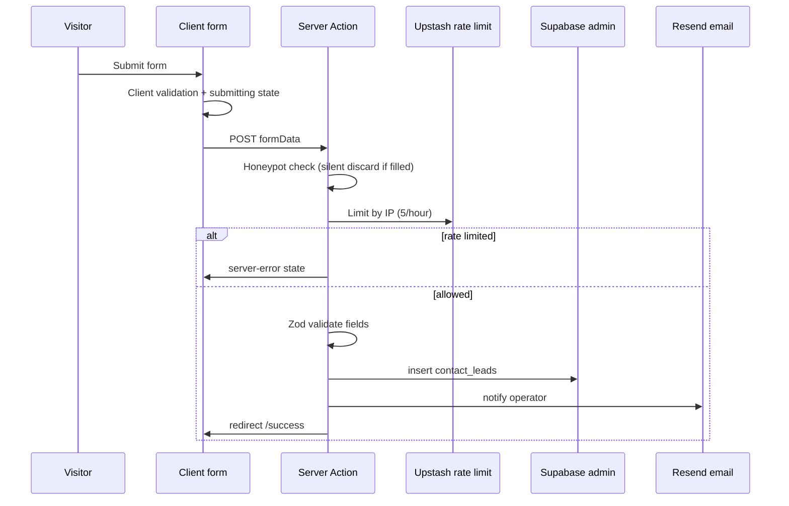
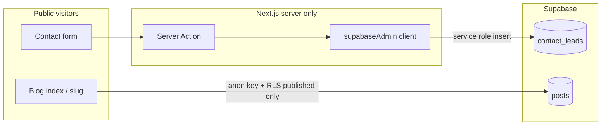
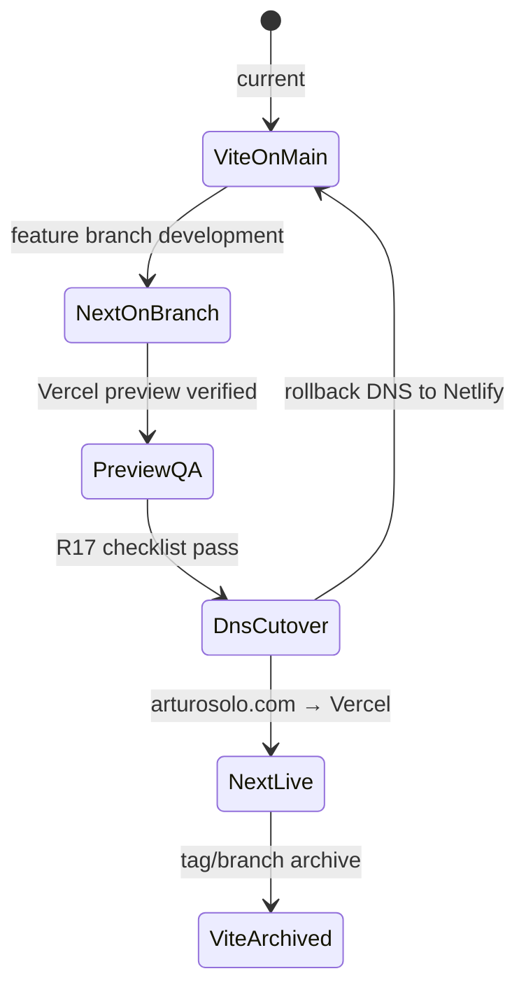

# feat: Next.js Nuggets Template Migration

## Summary

Greenfield rebuild of arturosolo.com on **Next.js 14 (App Router)** using the **Nuggets** agency template, with **Supabase** for contact-lead capture and a dynamic blog, deployed to **Vercel**. June 2026 positioning and copy map onto Nuggets' section IA via a template-native remap. Development runs on a parallel branch while the Vite site on `main` stays deployable until DNS cutover.

---

## Problem Frame

The current Vite + React SPA served the June 2026 story-scroll redesign well, but the next step is a different visual system — not an iteration of GSAP pinned/stacked scroll. Nuggets is Next.js-only and ships Framer Motion, Supabase-backed contact and blog, SSR, and multi-section agency IA. Adopting it means a platform migration (Vite → Next.js), backend migration (Netlify Forms → Supabase), and design reset — not a component port.

Business positioning from the AI consultancy pivot and story-scroll copy decisions remains valid. What changes is the delivery vehicle: agency-template sections rewritten for a founder-led AI build studio. (see origin: `docs/brainstorms/2026-07-05-nextjs-nuggets-migration-requirements.md`)

---

## Requirements

Requirements trace to origin R1–R25. Grouped by concern.

**Platform and delivery**

- R1. Production site runs on Next.js 14 App Router, scaffolded from the purchased Nuggets template.
- R2. Development occurs on a parallel git branch; Vite on `main` remains deployable until cutover.
- R3. Production hosting is Vercel with Supabase env vars per deploy context. Service role key never ships to client bundles. Preview and production use isolated Supabase projects.

**Positioning and content mapping**

- R4. Homepage sections carry June 2026 positioning: working AI, built into your business — founder-led AI build studio.
- R5. Hero delivers the opening promise with contrast language (working systems, not decks or demos).
- R6. Services presents AI Jumpstart and Custom AI Build as primary offerings.
- R7. Process describes the method: discover bottleneck → build until it runs → expand.
- R8. Stats presents hybrid proof without implying only two shipped products or naming unfinished work as finished portfolio items.
- R9. Team is a visible solo-founder "Why Arturo" block — not hidden, removed, or a multi-person grid.
- R10. Blog is Supabase-backed at `/blog`; v1 may launch with zero posts but infrastructure must be operable.
- R11. Contact captures leads to Supabase with fields matching the current form contract, server-mediated writes, honeypot, and basic rate limiting.
- R12. Privacy Policy and Terms ship with Arturo-specific copy before cutover, including Supabase lead storage disclosure.

**Experience and quality**

- R13. Motion uses template Framer Motion patterns with `prefers-reduced-motion: reduce` fallbacks. No GSAP or story-scroll port.
- R14. Site is fully responsive per template baseline.
- R15. SEO metadata configured for Arturo Solo LLC on all public routes.
- R16. Contact path remains warm and lower-friction than kinetic homepage sections.
- R20. Contact form exposes submitting, validation-error, server-error, and success states.
- R21. Successful submission shows warm confirmation via `/success` (preferred) or equivalent inline state.
- R22. Mobile menu toggle exposes `aria-expanded` and `aria-controls` with keyboard behavior verified.

**Security and data**

- R23. Supabase RLS on contact-leads denies anonymous SELECT, UPDATE, DELETE. Public writes limited to validated server-mediated inserts.

**Cutover and operations**

- R17. Vercel preview deploy verified before DNS cutover per smoke checklist.
- R18. DNS for `arturosolo.com` points to Vercel without breaking email or unrelated records.
- R19. After cutover, Vite codebase on `main` is archived (tag or branch).
- R24. Next branch passes lint, build, unit tests, and e2e smoke before cutover.
- R25. `AGENTS.md` updated when the parallel branch becomes the active development surface.

---

## Key Technical Decisions

- KTD1. **Greenfield rebuild, not file port:** Scaffold from Nuggets template on a new branch; port copy and assets from `src/components/sections/StoryScrollExperience.tsx` and `Contact.tsx`, not Vite components or GSAP logic. (see origin: Key Decisions)

- KTD2. **Template-native section remap (Option A):** Keep Nuggets agency IA; map story beats to sections. Beat 2 (bottlenecks → systems) absorbs into Hero subhead or Services lead paragraph — no new section shell. (see origin: R4–R9)

- KTD3. **Separate Supabase projects for preview and production:** Two projects with Vercel env scoping (Production vs Preview vs Development). Cleanest isolation for R3; avoids test leads in production data.

- KTD4. **Server Action + admin client for contact writes:** Contact submissions use a `'use server'` action with a `server-only` Supabase admin client (`SUPABASE_SERVICE_ROLE_KEY`). RLS enabled with no anon policies as failsafe. Do not use anon-key client inserts.

- KTD5. **Rate limiting via Upstash Redis:** `@upstash/ratelimit` in the Server Action (5 submissions/IP/hour default). Vercel WAF optional as a second layer; in-memory counters are insufficient on serverless.

- KTD6. **Lead notification via email provider:** After successful Supabase insert, trigger operator email via Resend (or SendGrid) from the Server Action or a Supabase Database Webhook. Operator should not rely on dashboard polling alone.

- KTD7. **Blog v1: infrastructure + dashboard publishing:** Public reads via anon/session client + RLS (`status = 'published'`). Operator publishes via Supabase dashboard or SQL; no custom `/admin` route in v1. Homepage blog teaser hidden when post count is zero.

- KTD8. **Parallel branch CI without breaking Vite `main`:** Add a path-filtered or branch-specific GitHub workflow for the Next tree. Keep existing `.github/workflows/ci.yml` on `main` for Vite until cutover.

- KTD9. **Vercel production, Netlify domain registration:** Deploy to Vercel; repoint DNS at cutover. Domain registration may remain at Netlify.

- KTD10. **Extend Supabase schema for `service` field:** Adopt Nuggets template tables as baseline; extend contact-leads with `service` text constrained to `ai-jumpstart`, `custom-ai-build`, `not-sure`.

---

## High-Level Technical Design

### Section copy map (story beats → Nuggets IA)

| Nuggets section | Primary copy source | Notes |
|-----------------|---------------------|-------|
| Hero | Story beat 1 (opening promise) | Beat 2 subhead: "Your messy process is the map" |
| Services | Beat 5 (AI Jumpstart) + R6 (Custom AI Build) | Not beat 6 — beat 6 maps to Team |
| Process | Beat 4 (method) | R7 |
| Stats | Beat 3 (hybrid proof) | Reuse `public/clients/*.png` where honest; R8 |
| Team | Beat 6 (Why Arturo) | Solo-founder block; headshot when available |
| Blog teaser | Optional | Hidden when zero posts |
| Contact | Beat 7 + `Contact.tsx` tone | Port "good first message" examples; R16 |
| Header/footer CTAs | `Header.tsx` / `Footer.tsx` patterns | "Bring me a bottleneck" / "Start AI Jumpstart" |

### Contact submission pipeline

### Supabase security model

RLS on `contact_leads`: enabled, no anon/authenticated policies, explicit `GRANT INSERT` to `service_role` only. Blog `posts`: public SELECT where `status = 'published'`; operator writes via authenticated session when using dashboard.

### Cutover state machine

Rollback trigger: production contact e2e fails within 15 minutes of DNS flip. Revert DNS to Netlify; Vite on `main` remains deployable until R19 archive.

---

## Scope Boundaries

### In scope

Greenfield Next scaffold, Supabase schema/RLS, section copy remap, contact pipeline, blog infrastructure (empty launch OK), Privacy/Terms, CI/e2e for Next branch, cutover runbook, `AGENTS.md` rewrite.

### Deferred for later

Per origin: historical Netlify Form migration, product screenshots, dedicated case-study page, named in-development products, visual-regression gates, content migration automation from Vite component tree, custom `/admin` blog CMS route, real footer social URLs (remove or stub honestly at cutover).

### Outside this product's identity

Per origin: GSAP seven-beat story-scroll recreation, design-agency positioning, generic "trusted by" logo strip, inflated unfinished-product claims, Netlify Forms as lead backend.

### Deferred to Follow-Up Work

- Seed blog posts (operator preference; infrastructure ready in v1)
- Custom legal review beyond template-edited boilerplate
- Netlify submission export tooling
- Portfolio/case-study page decision

---

## Implementation Units

### U1. Scaffold parallel branch and import Nuggets template

**Goal:** Create the Next.js 14 App Router project from the purchased Nuggets template on a feature branch without disturbing Vite `main`.

**Requirements:** R1, R2

**Dependencies:** None

**Files:**
- Create: Next app tree from Nuggets template (expected `app/`, `components/`, `lib/`, `public/`)
- Create: `vercel.json` (if template does not include)
- Modify: root `package.json` or use subdirectory strategy per template layout
- Create: `.env.example` with `NEXT_PUBLIC_SUPABASE_URL`, `NEXT_PUBLIC_SUPABASE_ANON_KEY`, `SUPABASE_SERVICE_ROLE_KEY`, `RESEND_API_KEY`, `UPSTASH_REDIS_REST_URL`, `UPSTASH_REDIS_REST_TOKEN`

**Approach:** Branch from `main` (e.g., `feat/nextjs-nuggets`). Replace the app tree with the Nuggets template on the feature branch — the branch carries Next exclusively; `main` keeps Vite untouched until merge. Import template verbatim first; verify `npm run dev` and `npm run build` before content changes. If Nuggets ships as a subdirectory, document the layout in a brief README section on the branch.

**Patterns to follow:** Origin greenfield decision; no Vite file ports.

**Test scenarios:**
- Happy path: `npm run build` succeeds on a clean install after template import.
- Edge case: Node 20 matches current CI (`.github/workflows/ci.yml`).
- Error path: Missing env vars produce clear build/runtime errors, not silent client exposure of service role.

**Verification:** Local dev server renders Nuggets homepage skeleton; branch pushes without affecting Netlify `main` deploy.

---

### U2. Provision Supabase schema, RLS, and Vercel env wiring

**Goal:** Stand up preview and production Supabase projects with contact-leads and blog tables, RLS policies, and Vercel-scoped environment variables.

**Requirements:** R3, R10, R11, R23

**Dependencies:** U1

**Files:**
- Create: `supabase/migrations/001_initial_schema.sql` (or equivalent migration files)
- Create: `lib/supabase/admin.ts` (`import 'server-only'`)
- Create: `lib/supabase/server.ts`, `lib/supabase/client.ts` per `@supabase/ssr` pattern
- Modify: Vercel project settings (dashboard) for Production vs Preview env scoping

**Approach:** Create two Supabase projects (`arturosolo-prod`, `arturosolo-dev`). Migration defines `contact_leads` (id, name, email, company, service, message, created_at) and `posts` (id, slug, title, body, status, author_id, published_at). Enable RLS on both. Contact: revoke anon/authenticated grants; grant INSERT to service_role only; no SELECT policies for anon. Blog: policy for public SELECT where `status = 'published'`. Extend template schema if `service` column is absent. Wire Vercel env vars per KTD3. Add explicit table GRANTs per Supabase 2026 API exposure changes.

**Patterns to follow:** KTD3, KTD4, KTD10; external research on `server-only` admin client.

**Test scenarios:**
- Happy path: Server-side insert into `contact_leads` via admin client succeeds in dev project.
- Edge case: Anon key SELECT on `contact_leads` returns empty or permission denied.
- Error path: Missing `SUPABASE_SERVICE_ROLE_KEY` throws at import time in admin module, not in client bundle.
- Integration: Preview Vercel deploy reads dev Supabase URL; production reads prod URL.

**Verification:** SQL migration applies cleanly on both projects; env vars scoped correctly in Vercel dashboard.

---

### U3. Remap homepage sections with Arturo copy

**Goal:** Rewrite each Nuggets homepage section with June 2026 positioning and story-scroll messaging beats.

**Requirements:** R4, R5, R6, R7, R8, R9, R13, R14, R15

**Dependencies:** U1

**Files:**
- Modify: Nuggets section components under `components/` or `app/page.tsx` section imports
- Reference: `src/components/sections/StoryScrollExperience.tsx` (copy source only)
- Reference: `docs/brainstorms/2026-06-01-ai-consultancy-pivot-requirements.md`
- Copy assets: `public/clients/*.png`, `public/favicon.svg`, `public/arthur_turnbull-headshot.jpg`
- Modify: `app/layout.tsx` or per-route metadata for SEO (R15)

**Approach:** Apply section copy map from HTD. Hero: "Working AI. In your business." with beat-2 subhead on messy processes. Services: AI Jumpstart + Custom AI Build only. Process: three-step method from beat 4. Stats: hybrid proof language from beat 3; client logos as subordinate proof, not a "trusted by" strip. Team: solo-founder "Why Arturo" with headshot or text-first fallback. Audit every Framer Motion wrapper for reduced-motion static fallbacks. Configure title, description, OG, and Twitter Card site-wide.

**Patterns to follow:** Origin R4–R9; `docs/solutions/design-patterns/story-scroll-founder-builder-homepage.md` (preserve proof model and tonal split, retire scroll mechanics).

**Test scenarios:**
- Covers AE1. Hero renders builder language, not design-agency tagline.
- Covers AE2. Services shows AI Jumpstart and Custom AI Build only.
- Covers AE3. Stats communicates hybrid proof without vanity metrics framing.
- Covers AE4. Team renders solo-founder block, not multi-person grid.
- Covers AE8. Stats items read as builder evidence.
- Edge case: `prefers-reduced-motion: reduce` — homepage sections render without motion-dependent visibility.
- Happy path: Responsive layout at mobile and desktop breakpoints.

**Verification:** Manual scan at 375px and 1280px; reduced-motion check passes; homepage and legal route metadata present.

---

### U4. Implement contact form, Server Action, and success flow

**Goal:** Replace Netlify Forms with a server-mediated Supabase contact pipeline including all visitor-facing states and operator notification.

**Requirements:** R11, R16, R20, R21, R23; F2

**Dependencies:** U2, U3

**Files:**
- Create: `app/actions/submit-contact.ts` (or `lib/actions/contact.ts`)
- Create: `lib/validation/contact.ts` (Zod schema)
- Create: `lib/rate-limit.ts` (Upstash)
- Create: `lib/email/notify-lead.ts` (Resend)
- Modify: Nuggets contact section component
- Create or modify: `app/success/page.tsx`
- Create: `src/components/sections/Contact.test.tsx` equivalent under Next test tree (e.g., `__tests__/contact-form.test.tsx`)

**Approach:** Port warm copy from `src/components/sections/Contact.tsx` including example messages and `start@arturosolo.com`. Form fields: name, email, company, service (`ai-jumpstart`, `custom-ai-build`, `not-sure`), message. Honeypot field `website` — silent fake success if filled (no DB row). Server Action flow per HTD sequence diagram. Client states: submitting, validation-error, server-error (including rate limit), success via redirect to `/success`. Rewrite `/success` with warm confirmation matching contact tone, not generic "Thank You!". Resend notification to operator on successful insert.

**Patterns to follow:** KTD4, KTD5, KTD6; prior Netlify field contract from `Contact.tsx` and `index.html`.

**Test scenarios:**
- Covers AE5. Valid submission inserts row with all fields and navigates to `/success`.
- Happy path: All required fields present; service enum values persist correctly.
- Edge case: Honeypot filled — visitor sees success, no row inserted.
- Edge case: Rate limit exceeded — server-error state with retry guidance.
- Error path: Supabase insert failure — server-error state, form data preserved.
- Error path: Invalid email or missing required field — validation-error with field messages.
- Integration: End-to-end submit on preview deploy writes to dev Supabase and sends notification email.

**Verification:** Preview deploy contact submit completes full pipeline; `/success` renders warm copy.

---

### U5. Blog infrastructure and empty-state contract

**Goal:** Ship working `/blog` index and post detail routes backed by Supabase, operable for operator publishing even with zero launch posts.

**Requirements:** R10, R15; F3

**Dependencies:** U2, U3

**Files:**
- Modify or create: `app/blog/page.tsx`, `app/blog/[slug]/page.tsx`
- Modify: Homepage blog teaser component (conditional render)
- Create: `__tests__/blog.test.tsx`

**Approach:** Public blog reads via server Supabase client with RLS (published posts only). Empty index: HTTP 200 with intentional "Posts coming soon" messaging. Homepage blog section hidden when `count(posts where status = published) === 0`. Post detail at `/blog/[slug]` SSR from Supabase. Document operator publish steps in branch README: insert row via Supabase dashboard with `status = 'published'`. No `/admin` route in v1 (KTD7).

**Patterns to follow:** KTD7; origin deferred blog now in v1 as infrastructure.

**Test scenarios:**
- Happy path: `/blog` returns 200 with empty-state copy when no posts exist.
- Happy path: Published post appears on index and renders at `/blog/[slug]`.
- Edge case: Draft post (`status != 'published'`) not visible to anon visitors.
- Edge case: Homepage blog teaser absent when post count is zero.
- Error path: Unknown slug returns 404.

**Verification:** `/blog` reachable on preview deploy; operator can publish one test post via dashboard and see it live; blog route metadata present.

---

### U6. Legal pages, accessibility, and header/footer cleanup

**Goal:** Ship Arturo-specific Privacy Policy and Terms; implement mobile menu ARIA; remove placeholder dead-end links.

**Requirements:** R12, R22

**Dependencies:** U3

**Files:**
- Create: `app/privacy/page.tsx`, `app/terms/page.tsx`
- Modify: Nuggets header (mobile menu `aria-expanded`, `aria-controls`)
- Modify: Footer links (real URLs or remove social placeholders)
- Create: `__tests__/header-a11y.test.tsx`
- Create: `e2e/a11y-mobile-menu.spec.ts`

**Approach:** Privacy Policy from template boilerplate edited for Arturo: fields collected, Supabase storage, operator-only access, 24-month retention default, deletion via `start@arturosolo.com`. Terms: standard marketing-site boilerplate. Mobile menu: wire `aria-expanded` and `aria-controls` to panel id; verify keyboard open/navigate/close. Footer: replace `href="#"` social links with real profiles or remove icons. Fix location `href="#"` pattern from current Contact if ported.

**Patterns to follow:** Origin R12; outstanding Vite backlog items folded into migration scope.

**Test scenarios:**
- Happy path: `/privacy` and `/terms` render Arturo-specific copy including Supabase disclosure.
- Covers R22. Mobile menu toggle exposes correct `aria-expanded` and `aria-controls` when opened/closed.
- Edge case: Keyboard-only user can open menu, activate link, close menu.
- Error path: No `href="#"` placeholders remain in production nav or footer at cutover.

**Verification:** R17 checklist items for legal pages and mobile menu ARIA pass on preview deploy.

---

### U7. CI pipeline and e2e smoke suite for Next branch

**Goal:** Next branch passes lint, build, unit tests, and e2e smoke equivalent to the current Vite verification bar.

**Requirements:** R24

**Dependencies:** U4, U5, U6

**Files:**
- Create: `.github/workflows/next-ci.yml` (branch/path filtered)
- Create or modify: `playwright.config.ts` for Next dev/preview server
- Create: `e2e/homepage.spec.ts`, `e2e/contact.spec.ts`, `e2e/blog.spec.ts`
- Create: Vitest or Jest config for Next (per template defaults)
- Retain: `.github/workflows/ci.yml` unchanged for Vite `main`

**Approach:** New workflow triggers on pushes to the Next feature branch (or when `app/` directory changes). Pipeline: lint → unit test → build → Playwright against `next start` or Vercel preview URL in CI. E2e smoke: homepage loads, `/blog` returns 200, contact form submits to dev Supabase and reaches `/success`. Retire Vite story-scroll e2e helpers; do not run GSAP-specific tests on Next branch.

**Patterns to follow:** Current `.github/workflows/ci.yml` four-step bar; origin R24.

**Test scenarios:**
- Happy path: CI workflow green on feature branch push.
- Integration: Contact e2e uses dev Supabase credentials from CI secrets.
- Edge case: Workflow does not run Vite-specific tests when only Next files change on feature branch.
- Error path: Failed contact insert fails e2e with actionable error output.

**Verification:** `npm run lint`, `npm run test`, `npm run build`, `npm run test:e2e` all pass locally and in CI on the feature branch.

---

### U8. Cutover runbook, Vite archive, and AGENTS.md rewrite

**Goal:** Execute production cutover safely, archive the Vite stack, and update agent invariants for the new development surface.

**Requirements:** R17, R18, R19, R25; F4; AE6

**Dependencies:** U7

**Files:**
- Create: `docs/runbooks/2026-07-05-vercel-cutover.md`
- Modify: `AGENTS.md`
- Create: git tag e.g. `archive/vite-story-scroll-2026-07-05` on pre-cutover `main` commit
- Modify: DNS records at domain registrar (document steps; no automation required in repo)
- Modify: `vercel.json` security headers (replace Vite `public/_headers` CSP)

**Approach:** Runbook documents: pre-cutover preview QA checklist — desktop and mobile smoke, contact submit to Supabase (including `/success`), blog index renders, Privacy/Terms reachable with Arturo copy, reduced-motion on homepage and contact, mobile menu `aria-expanded`/`aria-controls` (origin R17); low-traffic cutover window; DNS repoint steps preserving MX/email records; post-cutover prod smoke; rollback = revert DNS to Netlify within 15 minutes if contact fails. Define Vercel security headers (replace Vite `public/_headers` CSP) in `vercel.json` or Vercel dashboard before cutover. After successful cutover, tag `main` at last Vite commit and merge Next branch to `main`. Rewrite `AGENTS.md`: Next.js 14, Framer Motion, Supabase, multi-section IA, server-mediated contact, Vercel deploy — supersede all Vite/GSAP/Netlify/story-scroll invariants. Note deliberate Framer Motion re-adoption (inverts `docs/solutions/tooling-decisions/drop-framer-motion-for-css-and-gsap.md`).

**Patterns to follow:** Origin F4, R17–R19, R25; HTD cutover state machine.

**Test scenarios:**
- Covers AE6. After DNS cutover, `arturosolo.com` serves Vercel Next site and contact still submits.
- Happy path: Rollback procedure documented and validated in dry-run (DNS revert steps listed).
- Integration: Production Vercel env uses prod Supabase credentials only.
- Edge case: `main` history recoverable via archive tag after Next merge.
- Manual QA: Cold-visitor positioning scan (AE7) — homepage reads as builder/systems, not generic agency.

**Verification:** Cutover checklist signed off; `AGENTS.md` reflects new stack; archive tag exists; production contact e2e passes within 15 minutes of DNS flip.

---

## Acceptance Examples

- AE1. **Covers R4, R5.** Cold visitor on `/` reads hero and encounters working-AI builder language.
- AE2. **Covers R6.** Services shows AI Jumpstart and Custom AI Build.
- AE3. **Covers R8.** Stats scan conveys products, workflows, and client contexts.
- AE4. **Covers R9.** Team renders solo-founder Why Arturo block.
- AE5. **Covers R11, R20, R21.** Valid contact submit persists to Supabase and shows warm success.
- AE6. **Covers R17, R18, R19.** DNS cutover serves Vercel Next; contact works; Vite archived.
- AE7. **Covers R4, R6, R9.** Visitor language reflects builder/systems positioning.
- AE8. **Covers R8.** Stats items read as builder evidence, not vanity metrics.

---

## System-Wide Impact

**End users:** Homepage IA changes from story-scroll to agency sections; contact gains explicit submission states (improvement if implemented). Legal links become real pages.

**Operator:** Must manage Supabase projects, Vercel env vars, Resend API key, and Upstash credentials. Lead workflow shifts from Netlify email notifications to Supabase + Resend.

**Developers:** `AGENTS.md` invariants flip entirely. CI splits between Vite `main` (until cutover) and Next feature branch. All story-scroll tests and docs become historical reference.

**Infrastructure:** DNS moves from Netlify publish to Vercel. Netlify remains viable for domain registration. CSP and security headers need redefinition for Next (current `public/_headers` is Vite-specific).

**Data lifecycle:** Contact PII in Supabase with 24-month retention default; deletion on request via email. No historical Netlify submission migration.

---

## Risks & Dependencies

| Risk | Mitigation |
|------|------------|
| Service role key exposed in client bundle | `server-only` admin module; CI grep for `SUPABASE_SERVICE_ROLE_KEY` in client paths |
| Test leads in production Supabase | Separate projects (KTD3); Vercel env scoping |
| Cutover downtime or broken contact | Documented rollback to Netlify DNS; Vite stays deployable until archive |
| Nuggets template drift from docs | Verify against purchased template; pin template version in runbook |
| Supabase API key format changes (2026) | Use publishable/secret key naming; follow Supabase migration guide |
| Rate limit blocks legitimate user | 5/hour/IP with clear server-error message; operator can retrieve lead from email notification |
| Empty blog looks broken | Intentional empty state + hidden homepage teaser |
| Beat-2 messaging lost in remap | Explicit Hero subhead or Services intro per KTD2 |

**Dependencies:** Nuggets template purchased and downloadable; Supabase and Vercel account access; GitHub repo connected to Vercel; Resend (or equivalent) API key; Upstash Redis instance.

---

## Open Questions

Resolved during planning (defaults applied):

| Origin question | Resolution |
|-----------------|------------|
| Blog empty vs seed posts | Empty index with intentional copy; optional seed post before cutover |
| Schema alignment | Extend template for `service` field (KTD10) |
| Privacy/Terms source | Template boilerplate → Arturo edit |
| Preview vs prod Supabase | Separate projects (KTD3) |
| Cutover window / rollback | Low-traffic window; DNS revert to Netlify (HTD) |
| Lead retention | 24 months; deletion on request; stated in Privacy Policy |
| Blog auth model | Supabase dashboard publishing v1; no `/admin` route (KTD7) |
| Lead notification | Resend email on insert (KTD6) |

Deferred to implementation-time discovery:

- Exact Nuggets file paths after template import (section component names)
- Whether template uses App Router `app/` at repo root or subdirectory
- Final Resend vs SendGrid choice (Resend assumed)

---

## Sources & Research

- Origin: `docs/brainstorms/2026-07-05-nextjs-nuggets-migration-requirements.md`
- Positioning baselines: `docs/brainstorms/2026-06-01-ai-consultancy-pivot-requirements.md`, `docs/brainstorms/2026-06-03-story-scroll-redesign-requirements.md`
- Copy sources: `src/components/sections/StoryScrollExperience.tsx`, `src/components/sections/Contact.tsx`
- Institutional learnings: `docs/solutions/design-patterns/story-scroll-founder-builder-homepage.md`, `docs/solutions/tooling-decisions/drop-framer-motion-for-css-and-gsap.md` (historical; inverted for this migration)
- Nuggets template: https://21st.dev/@shuvamk/templates/nuggets-design-agency-website
- Supabase + Next.js: `@supabase/ssr` server/client split, RLS with service-role server writes
- Rate limiting: `@upstash/ratelimit` for Server Actions on Vercel
- Current deploy: `netlify.toml`, `.github/workflows/ci.yml`
